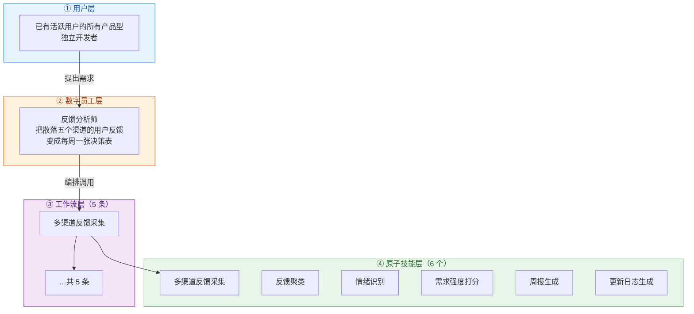
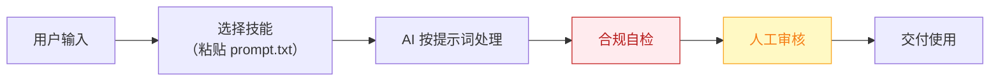

# 反馈分析师 — 业务架构

## 四层视图

## 资产形态说明

本资产包为**纯提示词客户端资产**：

| 特性 | 说明 |
|------|------|
| 无运行时依赖 | 不调用任何模型 API，不需要 API Key |
| 平台无关 | 提示词为纯文本，可导入任意主流 AI 平台 |
| 用户自备算力 | 模型由用户自己的订阅提供 |
| 零服务端成本 | 资产方不产生任何调用费用 |

## 数据流

> **关键设计**：所有对外输出必须经过「合规自检 → 人工审核」双闸门。

## 能力边界

| 维度 | 内容 |
|------|------|
| **目标用户** | 已有活跃用户的所有产品型独立开发者 |
| **做** | 多渠道反馈采集、去重聚类、情绪与优先级打标、周报与路线图建议 |
| **不做** | 不做：代替用户做最终产品决策、自动对外回复（回复归 #6 客服） |
| **KPI** | 反馈覆盖率（已采集渠道/全渠道）100%；周报准时率；高优需求从提出到进路线图 ≤2 周 |
| **定价** | ¥49-99/月；ROI 汇总：月省约 25h ≈ ¥2000 vs 订阅，回报比 >20 倍 |

---

*本图由 build_p0_assets.py 自动生成*
