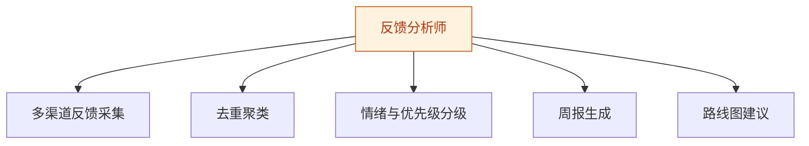
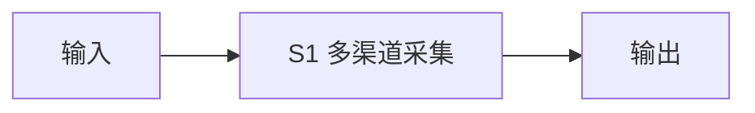
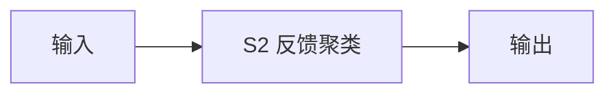
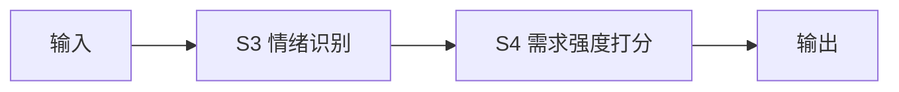
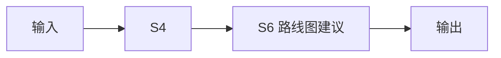

# 反馈分析师 — 工作流流程图

本员工共 **5 条工作流**，下辖 **6 个原子技能**。

## 总览

## 分条详情

### 多渠道反馈采集

| 项目 | 内容 |
|------|------|
| 触发 | 定时（每日） |
| 复杂度 | `M` |
| 阶段 | `P1` |
| ROI | 省 0.5h/日 ≈ ¥1200/月 |

### 去重聚类

| 项目 | 内容 |
|------|------|
| 触发 | 事件（采集后） |
| 复杂度 | `S` |
| 阶段 | `P1` |
| ROI | 含于 W1 |

### 情绪与优先级分级

| 项目 | 内容 |
|------|------|
| 触发 | 事件（聚类后） |
| 复杂度 | `S` |
| 阶段 | `P1` |
| ROI | 省 0.3h/日 ≈ ¥720/月 |

### 周报生成

| 项目 | 内容 |
|------|------|
| 触发 | 定时（每周一） |
| 复杂度 | `S` |
| 阶段 | `P1` |
| ROI | 省 2h/周 ≈ ¥640/月 |

### 路线图建议

| 项目 | 内容 |
|------|------|
| 触发 | 定时（每月） |
| 复杂度 | `S` |
| 阶段 | `P2` |
| ROI | 决策提质，间接 ROI |

## 汇总表

| # | 工作流 | 阶段 | 复杂度 | 触发 | 涉及技能数 |
|---|--------|------|--------|------|-----------|
| 1 | 多渠道反馈采集 | `P1` | `M` | 定时（每日） | 1 |
| 2 | 去重聚类 | `P1` | `S` | 事件（采集后） | 1 |
| 3 | 情绪与优先级分级 | `P1` | `S` | 事件（聚类后） | 2 |
| 4 | 周报生成 | `P1` | `S` | 定时（每周一） | 1 |
| 5 | 路线图建议 | `P2` | `S` | 定时（每月） | 2 |

---

*本图由 build_p0_assets.py 自动生成*
