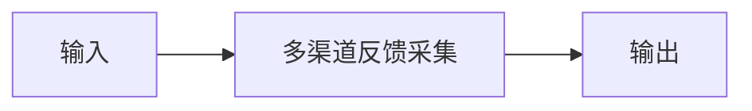

# 多渠道反馈采集

## 元信息

| 字段 | 值 |
|------|-----|
| ID | `de_dev_04_wf01` |
| 类型 | **`composite`（复合技能）** |
| 所属员工 | 反馈分析师 |
| 阶段 | `P1` |
| 复杂度 | `M` |
| 触发方式 | 定时（每日） |
| ROI | 省 0.5h/日 ≈ ¥1200/月 |
| 资产形态 | 工作流（编排提示词 + 确定性编排脚本） |

> 复合技能 = 工作流。它把多个**原子技能**按业务顺序编排在一起，完成一个完整场景。

## 能力描述

把来自客服邮箱、应用市场评论区、微信群等多渠道的原始反馈材料端到端整理入库：步骤 1 拆条规范化（每条生成标题/摘要、来源、时间、关键信息四要素，缺失项标注不补齐），步骤 2 去重排序（标题+来源去重保留最早一条，按时间升序），步骤 3 汇总入库（条目总数、各渠道来源分布、时间跨度与最集中问题）。一批建议 5-50 条，输出结构化反馈清单，供下游去重聚类、情绪识别、周报生成等工作流使用。配套确定性编排脚本 `scripts/run_flow.py`（纯标准库）可端到端复现，产物写入 `out/`（flow_items.csv / flow_report.json）。

## 使用步骤

### 方式一：运行编排脚本（可复现）

1. 进入本工作流目录，执行：`python scripts/run_flow.py --demo`（内置演示数据）或 `python scripts/run_flow.py --input examples/input.json`
2. 脚本按 DAG 顺序执行三个步骤：拆条规范化 → 去重排序 → 汇总入库，产物写入 `out/`
3. 产物：`flow_items.csv`（采集结果明细）、`flow_report.json`（summary / steps / deliverable 完整结构）

### 方式二：手动串联提示词

1. 把「多渠道反馈采集」的 prompt.txt 与原始材料交给 AI
2. 得到采集结果明细表与概要后，按「输出格式」组装执行摘要与最终交付物

### 方式三：在主流平台编排

| 平台 | 编排方式 |
|------|---------|
| **Coze / 扣子** | 新建工作流 → 按步骤添加节点，每个节点填入对应技能的 prompt.txt |
| **Dify** | 新建 Workflow → 添加 LLM 节点链，按 DAG 顺序连接 |
| **WorkBuddy** | 新建 Skill，按步骤在指令中串联各技能提示词 |

## 边界（不做的事）

- ❌ 不编造条目、时间戳、用户昵称或数据统计
- ❌ 不抓取需登录的私密数据，不绕过平台风控
- ❌ 不生成诱导好评、刷量、删差评等违规内容
- ❌ 不执行或建议任何绕过平台规则的操作
- ❌ 不涉及资金操作或代替用户做最终决策
- ❌ 不处理超出本职能力范围的请求（应明确说明并建议转其他技能）

## 调用示例

**输入**：

```json
{
  "input": "采集渠道：客服邮箱 feedback@yunjizhang.com、华为应用市场评论区、微信用户群「云记账·个体户交流 2 群」，时间窗口 2026-09-28 至 2026-10-04。原始材料：邮箱来信①（2026-09-29 14:22，刘先生）：「发票拍照识别老是认错金额，9.50 元识别成 95.0，急用」……"
}
```

**输出**：

```markdown
## 执行摘要

本批共 6 条反馈入库，来自客服邮箱（2 条）、华为应用市场（2 条）与微信用户群（2 条），时间跨度 2026-09-29 至 2026-10-03。

## 最终交付物

| # | 标题/摘要 | 来源 | 时间 | 关键信息 |
|---|---|---|---|---|
| 1 | 发票识别认错金额 | 客服邮箱 | 2026-09-29 14:22 | 9.50 元被识别成 95.0，请求修复 |

—— AI 生成内容，需人工复核 ——
```

## 所属工作流

- 本工作流为「多渠道反馈采集」端到端场景，是反馈分析链路的数据入口，下游衔接去重聚类与情绪与优先级分级

## 合规声明

- 本工作流输出为 **AI 辅助生成内容**，交付前必须经人工审核
- 用户昵称等个人信息保留最小必要，不得输出可识别个人身份的信息
- 请按所在平台要求完成 AI 生成内容标识

## 编排的原子技能

| # | 原子技能 | 能力 |
|---|---------|------|
| 1 | [多渠道反馈采集](../../skills/multichannel-feedback-collect/) | 各反馈渠道 API/邮件解析入库 |

## 步骤链路（DAG）



## 步骤明细

| # | 步骤 | 技能资产 | 输入 | 输出 | 失败处理 |
|---|------|---------|------|------|---------|
| 1 | 多渠道反馈采集 | [`../../skills/multichannel-feedback-collect/`](../../skills/multichannel-feedback-collect/) | 上一步输出 | 多渠道反馈采集 输出 | 记录错误并中止 |

## 步骤说明

邮件/应用商店/Discord/社群/问卷抓取 → 统一入库

## 输入规格

| 字段 | 类型 | 必填 | 说明 |
|------|------|------|------|
| `input` | string / object | ✅ | 工作流初始输入，由触发条件提供 |

## 输出规格

| 字段 | 类型 | 说明 |
|------|------|------|
| `summary` | string | 执行摘要 |
| `steps` | string | 分步结果 |
| `deliverable` | string | 最终交付物 |

## 错误处理

| 情况 | 处理方式 |
|------|---------|
| 输入缺失 | 提示缺少的字段，终止流程 |
| 中间步骤输出不合规 | 合规技能拦截，返回修改建议，不继续下游 |
| 提示词被平台截断 | 拆分任务，分两次处理 |

## 验收标准

- [ ] 每一步的技能资产齐全（SKILL.md / prompt.txt / schema.json）
- [ ] 步骤间输入输出字段可衔接
- [ ] 末步输出带 AI 生成标识
- [ ] 全流程有人工确认环节

## 在平台上的编排方式

| 平台 | 编排方式 |
|------|---------|
| **Coze / 扣子** | 新建工作流 → 按步骤添加节点，每个节点填入对应技能的 prompt.txt |
| **Dify** | 新建 Workflow → 添加 LLM 节点链，按 DAG 顺序连接 |
| **WorkBuddy** | 新建 Skill，按步骤在指令中串联各技能提示词 |
| **手动使用** | 按步骤顺序，逐个把 prompt.txt 与上一步输出交给 AI |

## 使用示例

```text
第 1 步：把「多渠道反馈采集」的 prompt.txt 粘贴到 AI，
         提供输入数据，得到输出 A。

第 2 步：把「下一技能」的 prompt.txt 粘贴到新的对话，
         把输出 A 作为输入，得到输出 B。

…依次类推，直到末步。
```

---

*本复合技能定义由 build_p0_assets.py 生成*
