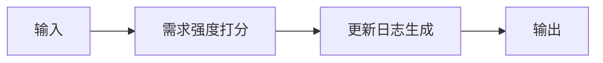

# 路线图建议

## 元信息

| 字段 | 值 |
|------|-----|
| ID | `de_dev_04_wf05` |
| 类型 | **`composite`（复合技能）** |
| 所属员工 | 反馈分析师 |
| 阶段 | `P2` |
| 复杂度 | `S` |
| 触发方式 | 定时（每月） |
| ROI | 决策提质，间接 ROI |
| 资产形态 | 工作流（编排提示词 + 确定性编排脚本） |

> 复合技能 = 工作流。它把多个**原子技能**按业务顺序编排在一起，完成一个完整场景。

## 能力描述

把需求清单转化为可决策的路线图建议：步骤 1 按频次 40%、付费意愿 35%、流失风险 25% 的权重（各维度 1-10 分加权求和，保留 1 位小数）对需求逐条打分并分层（S ≥8.0 优先做 / A 6.0-7.9 排期做 / B 4.0-5.9 观察 / C <4.0 暂缓）；步骤 2 对已上线需求按【新增】/【优化】/【修复】前缀生成更新日志草稿（单条 20-60 字，附受影响范围）；步骤 3 结合实现成本（人日）给出排期建议。配套确定性编排脚本 `scripts/run_flow.py`（纯标准库）可端到端复现，产物写入 `out/`（roadmap_scores.csv / roadmap_changelog.csv / roadmap_report.json）。

## 使用步骤

### 方式一：运行编排脚本（可复现）

1. 进入本工作流目录，执行：`python scripts/run_flow.py --demo`（内置演示数据）或 `python scripts/run_flow.py --input examples/input.json`
2. 脚本按 DAG 顺序执行：需求强度打分 → 更新日志生成，产物写入 `out/`
3. 产物：`roadmap_scores.csv`（打分分层）、`roadmap_changelog.csv`（日志草稿条目）、`roadmap_report.json`（summary / steps / deliverable 完整结构）

### 方式二：手动串联提示词

1. 第 1 步把「需求强度打分」的 prompt.txt 与需求记录交给 AI，得到打分分层结果
2. 第 2 步把「更新日志生成」的 prompt.txt 与已上线需求清单交给新的对话，得到 changelog 草稿
3. 按「输出格式」组装执行摘要、分步结果与路线图建议

### 方式三：在主流平台编排

| 平台 | 编排方式 |
|------|---------|
| **Coze / 扣子** | 新建工作流 → 按步骤添加节点，每个节点填入对应技能的 prompt.txt |
| **Dify** | 新建 Workflow → 添加 LLM 节点链，按 DAG 顺序连接 |
| **WorkBuddy** | 新建 Skill，按步骤在指令中串联各技能提示词 |

## 边界（不做的事）

- ❌ 不编造需求数据、实现成本或上线版本记录
- ❌ 不代替用户做最终排期决策；建议仅列依据与性价比参考
- ❌ 不使用违反《广告法》的极限词；changelog 不写绝对化效果承诺
- ❌ 不生成诱导好评、刷量、删差评等违规内容
- ❌ 不执行或建议任何绕过平台规则的操作
- ❌ 不处理超出本职能力范围的请求（应明确说明并建议转其他技能）

## 调用示例

**输入**：

```json
{
  "input": "R01 发票拍照自动识别：近30天提及 47 次，18/60 人愿付费，5 位流失表态，成本约 20 人日，v2.6.0 已上线；R02 多账本切换：提及 26 次，8/60 人愿付费，暂无流失表态，成本约 5 人日，v2.6.0 已上线……"
}
```

**输出**：

```markdown
## 执行摘要

本次共对 4 条需求完成打分分层（S/A/B/C = 1/0/3/0），建议本迭代优先处理「发票拍照识别」（总分 8.1）。

## 最终交付物

| # | 需求 | 总分 | 分层 | 建议动作 | 成本(人日) |
|---|---|---|---|---|---|
| 1 | 发票拍照自动识别 | 8.1 | S 级 | 本迭代优先做 | 20 |

—— AI 生成内容，需人工复核 ——
```

## 所属工作流

- 本工作流为「路线图建议」端到端场景，上游为去重聚类与情绪与优先级分级，输出供版本规划与对外公告使用

## 合规声明

- 本工作流输出为 **AI 辅助生成内容**，交付前必须经人工审核
- 更新日志草稿属对外发布文本，须保留产品核对与法务复核环节
- 请按所在平台要求完成 AI 生成内容标识

## 编排的原子技能

| # | 原子技能 | 能力 |
|---|---------|------|
| 1 | [需求强度打分](../../skills/demand-intensity-score/) | 按频次×付费意愿×流失风险打分 |
| 2 | [更新日志生成](../../skills/changelog-generate/) | 已上线需求自动生成 changelog |

## 步骤链路（DAG）



## 步骤明细

| # | 步骤 | 技能资产 | 输入 | 输出 | 失败处理 |
|---|------|---------|------|------|---------|
| 1 | 需求强度打分 | [`../../skills/demand-intensity-score/`](../../skills/demand-intensity-score/) | 上一步输出 | 需求强度打分 输出 | 记录错误并中止 |
| 2 | 更新日志生成 | [`../../skills/changelog-generate/`](../../skills/changelog-generate/) | 上一步输出 | 更新日志生成 输出 | 记录错误并中止 |

## 步骤说明

需求频次 × 强度 × 实现成本 → 优先级建议

## 输入规格

| 字段 | 类型 | 必填 | 说明 |
|------|------|------|------|
| `input` | string / object | ✅ | 工作流初始输入，由触发条件提供 |

## 输出规格

| 字段 | 类型 | 说明 |
|------|------|------|
| `summary` | string | 执行摘要 |
| `steps` | string | 分步结果 |
| `deliverable` | string | 最终交付物 |

## 错误处理

| 情况 | 处理方式 |
|------|---------|
| 输入缺失 | 提示缺少的字段，终止流程 |
| 中间步骤输出不合规 | 合规技能拦截，返回修改建议，不继续下游 |
| 提示词被平台截断 | 拆分任务，分两次处理 |

## 验收标准

- [ ] 每一步的技能资产齐全（SKILL.md / prompt.txt / schema.json）
- [ ] 步骤间输入输出字段可衔接
- [ ] 末步输出带 AI 生成标识
- [ ] 全流程有人工确认环节

## 在平台上的编排方式

| 平台 | 编排方式 |
|------|---------|
| **Coze / 扣子** | 新建工作流 → 按步骤添加节点，每个节点填入对应技能的 prompt.txt |
| **Dify** | 新建 Workflow → 添加 LLM 节点链，按 DAG 顺序连接 |
| **WorkBuddy** | 新建 Skill，按步骤在指令中串联各技能提示词 |
| **手动使用** | 按步骤顺序，逐个把 prompt.txt 与上一步输出交给 AI |

## 使用示例

```text
第 1 步：把「需求强度打分」的 prompt.txt 粘贴到 AI，
         提供输入数据，得到输出 A。

第 2 步：把「更新日志生成」的 prompt.txt 粘贴到新的对话，
         把输出 A 作为输入，得到输出 B。

…依次类推，直到末步。
```

---

*本复合技能定义由 build_p0_assets.py 生成*
