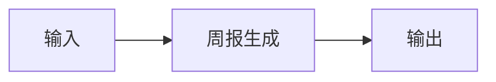

# 周报生成

## 元信息

| 字段 | 值 |
|------|-----|
| ID | `de_dev_04_wf04` |
| 类型 | **`composite`（复合技能）** |
| 所属员工 | 反馈分析师 |
| 阶段 | `P1` |
| 复杂度 | `S` |
| 触发方式 | 定时（每周一） |
| ROI | 省 2h/周 ≈ ¥640/月 |
| 资产形态 | 工作流（编排提示词 + 确定性编排脚本） |

> 复合技能 = 工作流。它把多个**原子技能**按业务顺序编排在一起，完成一个完整场景。

## 能力描述

把本期与上期的反馈指标数据、Top 需求与流失预警，端到端汇总成决策者 5 分钟可读完的周报：步骤 1 指标汇总（变化率 = 变化量 ÷ |上期| × 100%，保留 1 位小数；符号翻转标注「由正转负」；核心结论一句话先行）；步骤 2 要点汇总（Top 需求按提及次数降序、流失预警会员数）；步骤 3 决策表与行动建议（每条含动作、对象、时间要求；驱动因素只列变化超 ±10% 的指标）。配套确定性编排脚本 `scripts/run_flow.py`（纯标准库）可端到端复现，产物写入 `out/`（flow_metrics.csv / flow_weekly_report.json）。

## 使用步骤

### 方式一：运行编排脚本（可复现）

1. 进入本工作流目录，执行：`python scripts/run_flow.py --demo`（内置演示数据）或 `python scripts/run_flow.py --input examples/input.json`
2. 脚本按 DAG 顺序执行：指标汇总 → 要点汇总，产物写入 `out/`
3. 产物：`flow_metrics.csv`（指标对比明细）、`flow_weekly_report.json`（summary / steps / deliverable 完整结构，含 headline、drivers、top_demands、suggestion）

### 方式二：手动串联提示词

1. 把「周报生成」的 prompt.txt 与周报数据交给 AI
2. 得到关键指标表、Top 需求与行动建议后，按「输出格式」组装执行摘要与最终交付物

### 方式三：在主流平台编排

| 平台 | 编排方式 |
|------|---------|
| **Coze / 扣子** | 新建工作流 → 按步骤添加节点，每个节点填入对应技能的 prompt.txt |
| **Dify** | 新建 Workflow → 添加 LLM 节点链，按 DAG 顺序连接 |
| **WorkBuddy** | 新建 Skill，按步骤在指令中串联各技能提示词 |

## 边界（不做的事）

- ❌ 不编造指标、日期、Top 需求或流失预警数据
- ❌ 不给无法验收的空泛建议；不代替用户做最终决策
- ❌ 不在报告中对个人做评价或输出可识别个人身份的信息
- ❌ 不生成诱导好评、刷量、删差评等违规内容
- ❌ 不执行或建议任何绕过平台规则的操作
- ❌ 不处理超出本职能力范围的请求（应明确说明并建议转其他技能）

## 调用示例

**输入**：

```json
{
  "input": "云记账 App 周报数据。周期：2026-09-28 至 2026-10-04。指标：反馈总量本期 128 条 / 上期 97 条；闪退类投诉本期 41 条 / 上期 18 条；会员净增本期 -12 人 / 上期 +35 人……本周 Top 需求：1) 修复安卓端闪退（提及 41 次）。流失预警：6 位会员明确表示不修复将卸载或退订。"
}
```

**输出**：

```markdown
## 执行摘要

本期反馈总量环比上升 32.0%，主因闪退类投诉翻倍（+127.8%），闪退修复是当前第一优先事项。

## 最终交付物

| 指标 | 本期 | 上期 | 变化 |
|---|---|---|---|
| 会员净增 | -12 人 | +35 人 | -47 人（由正转负） |

—— AI 生成内容，需人工复核 ——
```

## 所属工作流

- 本工作流为「周报生成」端到端场景，是反馈分析链路的周度出口，上游为多渠道采集、去重聚类与情绪分级

## 合规声明

- 本工作流输出为 **AI 辅助生成内容**，交付前必须经人工审核
- 周报数据涉及经营信息，对外分发前须确认脱敏与权限
- 请按所在平台要求完成 AI 生成内容标识

## 编排的原子技能

| # | 原子技能 | 能力 |
|---|---------|------|
| 1 | [周报生成](../../skills/weekly-report-generate/) | 反馈数据汇总为决策周报 |

## 步骤链路（DAG）



## 步骤明细

| # | 步骤 | 技能资产 | 输入 | 输出 | 失败处理 |
|---|------|---------|------|------|---------|
| 1 | 周报生成 | [`../../skills/weekly-report-generate/`](../../skills/weekly-report-generate/) | 上一步输出 | 周报生成 输出 | 记录错误并中止 |

## 步骤说明

本周新增/Top 需求/流失预警 → 决策表 → 推送

## 输入规格

| 字段 | 类型 | 必填 | 说明 |
|------|------|------|------|
| `input` | string / object | ✅ | 工作流初始输入，由触发条件提供 |

## 输出规格

| 字段 | 类型 | 说明 |
|------|------|------|
| `summary` | string | 执行摘要 |
| `steps` | string | 分步结果 |
| `deliverable` | string | 最终交付物 |

## 错误处理

| 情况 | 处理方式 |
|------|---------|
| 输入缺失 | 提示缺少的字段，终止流程 |
| 中间步骤输出不合规 | 合规技能拦截，返回修改建议，不继续下游 |
| 提示词被平台截断 | 拆分任务，分两次处理 |

## 验收标准

- [ ] 每一步的技能资产齐全（SKILL.md / prompt.txt / schema.json）
- [ ] 步骤间输入输出字段可衔接
- [ ] 末步输出带 AI 生成标识
- [ ] 全流程有人工确认环节

## 在平台上的编排方式

| 平台 | 编排方式 |
|------|---------|
| **Coze / 扣子** | 新建工作流 → 按步骤添加节点，每个节点填入对应技能的 prompt.txt |
| **Dify** | 新建 Workflow → 添加 LLM 节点链，按 DAG 顺序连接 |
| **WorkBuddy** | 新建 Skill，按步骤在指令中串联各技能提示词 |
| **手动使用** | 按步骤顺序，逐个把 prompt.txt 与上一步输出交给 AI |

## 使用示例

```text
第 1 步：把「周报生成」的 prompt.txt 粘贴到 AI，
         提供输入数据，得到输出 A。

第 2 步：把「下一技能」的 prompt.txt 粘贴到新的对话，
         把输出 A 作为输入，得到输出 B。

…依次类推，直到末步。
```

---

*本复合技能定义由 build_p0_assets.py 生成*
